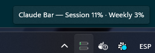

# Claude Bar for Windows

A lightweight Windows **system-tray** app that shows your Claude Code rate-limit
usage as two small battery-style bars — **Session (5h)** on top, **Weekly (7d)**
below.

This is a Windows port of **[tulinmola](https://github.com/tulinmola)'s** macOS
menu-bar app [tulinmola/claude-bar](https://github.com/tulinmola/claude-bar)
(via the [Quantum-Quacks](https://github.com/Quantum-Quacks/claude-bar) fork).
All credit for the original idea and design goes to tulinmola.



It reuses the credentials Claude Code already stored on your machine, so there's
no separate login. It's **read-only** and never makes inference calls.

## What it shows

- **Tray icon:** two horizontal battery bars, color-coded
  green `< 70%` → orange `70–90%` → red `≥ 90%`.
- **Menu (left/right-click the tray icon):**
  - Account: `email · Plan`
  - `Session (5h): NN%   resets HH:MM`
  - `Weekly (7d): NN%   resets Day HH:MM`
  - **Details** submenu: plan, full reset timestamps, per-model weekly usage, extra-usage credits, spend.
  - **Notifications** submenu (all configurable, see below)
  - Last-updated time (or an error message)
  - **Refresh Now**
  - **Start at Login** (toggle — adds/removes a Startup shortcut)
  - **Quit Claude Bar**

## Notifications

Native Windows toast notifications, configured entirely from the
**Notifications** submenu in the tray. There are **two independent alert
types**, each with its own on/off toggle, so you can enable either, both, or
neither.

### 1. Running-low alerts — "you're about to run out"

Fires the moment your usage crosses a threshold. Default: **on**, both windows
at **80 %**.

- *Session alert at* — 70 / 80 / 90 / 95 %
- *Weekly alert at* — 70 / 80 / 90 / 95 %

Example toast:
> **Claude usage running low**
> Session (5h) is at 85 % (alert ≥ 80 %).

### 2. Unused-quota reminders — "spend it or lose it"

Fires when a window is about to reset but you've barely used it. Default:
**off** (opt-in).

- *Session: remind before reset* — 15 / 30 / 60 minutes
- *Weekly: remind before reset* — 6 / 12 / 24 hours
- *Only if usage below* — 30 / 50 / 70 % (shared by both windows)

Example toast:
> **Unused Claude quota**
> Weekly (7d) resets in 5 h and only 10 % used — spend it or lose it.

### Behavior

- Each alert fires **once per crossing**. It re-arms when the condition clears
  (usage drops back below threshold, you spend down to the unused threshold, or
  the window resets).
- Alerts are evaluated after every poll (every 3 minutes) and after every
  manual **Refresh Now**.
- **Send test notification** at the bottom of the submenu fires a sample toast
  so you can confirm Windows toasts are enabled for this app.

### Menu tree

```
Notifications ▸
  ☑ Running-low alerts            (toggle)
     Session alert at ▸  70% / 80% / 90% / 95%
     Weekly alert at  ▸  70% / 80% / 90% / 95%
  ─────────
  ☐ Unused-quota reminders        (toggle, off by default)
     Session: remind before reset ▸  15 min / 30 min / 60 min
     Weekly:  remind before reset ▸  6 h / 12 h / 24 h
     Only if usage below          ▸  30% / 50% / 70%
  ─────────
     Send test notification
```

### Configuration file

All settings persist to `%USERPROFILE%\.claude-bar-windows.json`. You can edit
it by hand (restart the app to pick up changes — or just use the menu). Schema
and defaults:

```jsonc
{
  "low_enabled":            true,   // master toggle for running-low alerts
  "session_threshold":      80,     // % — fire when session usage hits this
  "weekly_threshold":       80,     // % — fire when weekly usage hits this

  "unused_enabled":         false,  // master toggle for unused-quota reminders
  "session_unused_minutes": 30,     // remind when session resets within N min
  "weekly_unused_hours":    12,     // remind when weekly resets within N hours
  "unused_max_util":        50      // ...and only if usage is still below this %
}
```

### Troubleshooting

- **No toast appears.** Open Windows *Settings → System → Notifications* and
  make sure notifications are enabled globally **and** in Focus Assist's "Do
  not disturb" exception list, then click **Send test notification**.
- **Alert never fires.** Check the master toggle for that alert type is on, and
  that the threshold makes sense for your current usage. Use the **Details**
  submenu to confirm the app sees your real numbers.

## How it works

- Reads your token from `%USERPROFILE%\.claude\.credentials.json`
  (`claudeAiOauth.accessToken`) and your email from `%USERPROFILE%\.claude.json`.
- Calls `GET https://api.anthropic.com/api/oauth/usage` with the OAuth headers.
- Polls every 3 minutes, with a 45-second minimum spacing between network calls.
- If the token is missing or expired it shows a hint to run `claude` to refresh.

## Install & run

Requires **Python 3.8+** (you have 3.10).

```powershell
cd windows
python -m pip install -r requirements.txt
```

Run it:

```powershell
# Background, no console window:
run.bat

# Or directly (keeps a console open):
python claude_bar.py
```

Preview the icon without launching the tray:

```powershell
python claude_bar.py --preview
```

## Start automatically at login

Either toggle **Start at Login** from the tray menu, or run `run.bat` once and
add a shortcut to it in your Startup folder (`shell:startup`).

## Notes / differences from the macOS version

- macOS reads the token from Keychain; on Windows Claude Code keeps it in the
  plaintext `.credentials.json` file, so that's what this reads.
- Token **auto-refresh** is not implemented — when the token expires, just run
  Claude Code (`claude`) once to refresh it and the app picks it up.
- The tray icon is drawn with Pillow and rendered at 64×64 so Windows scales it
  crisply down to the tray size.
